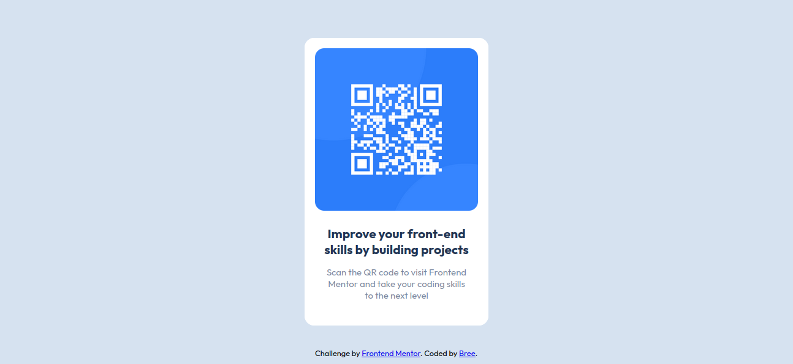

# Frontend Mentor - QR code component solution

This is a solution to the [QR code component challenge on Frontend Mentor](https://www.frontendmentor.io/challenges/qr-code-component-iux_sIO_H). Frontend Mentor challenges help you improve your coding skills by building realistic projects. 

### Screenshot

### Links

- Solution URL: (https://github.com/Brenda-M/Frontend-Mentor/tree/master/qr-code-component-main)
- Live Site URL: (https://656fac5054a539503f3a9c21--qr-generator-frontend-mentor.netlify.app/)

### Built with

- Semantic HTML5 markup
- CSS custom properties
- Mobile-first workflow

## Author
- Frontend Mentor - [@yourusername](https://www.frontendmentor.io/profile/Brenda-M)

